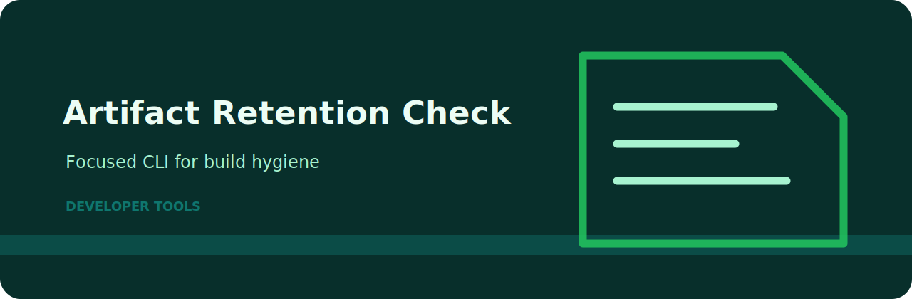
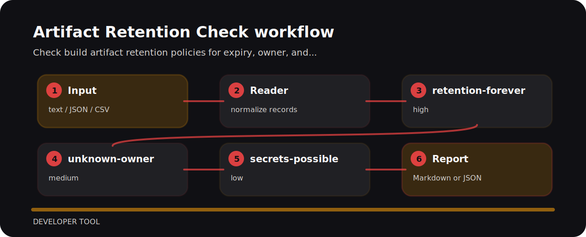

# Artifact Retention Check



## Use it when

Check build artifact retention policies for expiry, owner, and sensitive output risks. The command is intentionally direct so it can sit in a local review, a CI step, or a one-off audit.

## Run the sample

```bash
git clone https://github.com/mertefekurt/artifact-retention-check.git
cd artifact-retention-check
python -m pip install -e ".[dev]"
artifact-retention-check examples/sample.txt
```

## Review path



## Decision points

| Signal | Level | What it flags | Fix direction |
| --- | --- | --- | --- |
| `retention-forever` | high | artifact retention is unbounded | set retention window |
| `unknown-owner` | medium | artifact owner missing | assign artifact owner |
| `secrets-possible` | low | secrets may be in artifacts | scan and redact artifacts |

## Before a release

```bash
ruff check .
pytest
python -m artifact_retention_check --help
```
